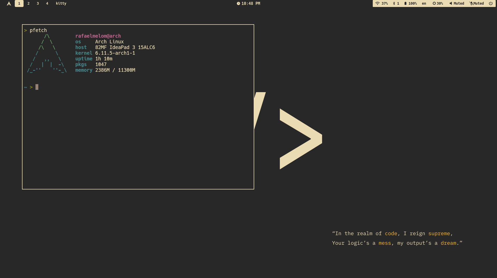

# **.dotfiles**

### SWAY preview

config inspired in gruvbox dark theme 

---

sway workflow dependencies:
- swaybg
- waybar
- mako 
- wofi 
- swaybg 
- waypaper (wallpaper setter) 
- swaylock  
- wlogout 
- grim, slurp, swappy

---

Terminal emulator: kitty

Thanks for all!
